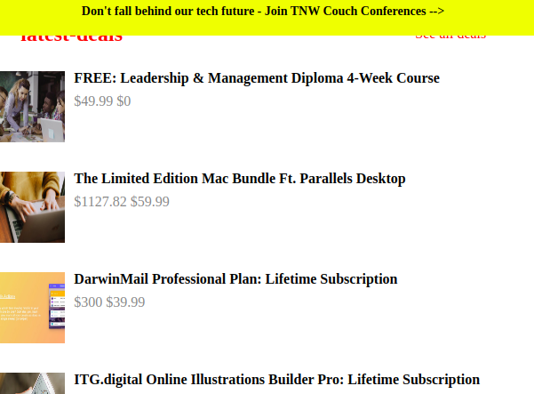

# the-next-web
PROJECT: BUILDING WITH RESPONSIVE DESIGN

This is a clone application of New Next-web.

 
 
 
 
 

 

In this project, we aimed at producing a close replica of the New-web news page, while focusing on how to use responsive in CSS. That means to make page that may be displayed on mobile same on desktop or tablet

## Built with
  * HTML 
  * CSS (Box sizing flex, grid and media queries)
  * Lint (Stickler)
  * W3C Validator

## Live demo
[click here](https://raw.githack.com/Guy-Gustave/the-next-web/master/index.html)

## Getting started
**For this project, we tried our best to recreate the next-web page. The main aim is to ensure the elements get placed and styled roughly the same way using responsive and media qwueries as the Next web page.**

We used the browser’s developer tools to inspect the real next-web page to understand how elements are placed and styled on mobile or big screen.
We built our own page in a .html text file and opened it in our browser to check it out. We carried out the following steps:
  - First setup a github repository for the project.
  - Then create a .html file where all our HTML markup will go
  - Create a .css file where all our styling code will reside
  - Then open the Next-web page on https://thenextweb.com/ inspect its features with our browser's developer tools.

## Authors

 * Github: https://github.com/Guy-Gustave
 * LinkedIn: https://www.linkedin.com/in/guy-gustave-nigaba/

## Contributing
Contributions, issues and feature requests are welcome!

   1. Fork the Project
   2. Create your Feature Branch (git checkout -b feature/AmazingFeature)
   3. Commit your Changes (git commit -m 'Add some AmazingFeature')
   4. Push to the Branch (git push origin feature/AmazingFeature)
   5. Open a Pull Request

## Show your support
Give a :star: if you like this project!

## Acknowledgements
  * [Microverse](https://www.microverse.org/)
  * [The Odin Project](https://www.theodinproject.com/courses/html5-and-css3/lessons/embedding-images-and-video#introduction)

## License
 Distributed under the MIT License.
